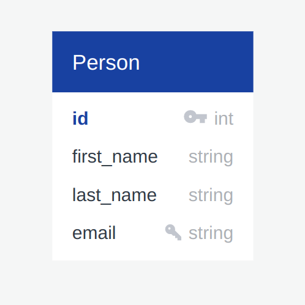

# Person API Documentation

This documentation provides information about the FastAPI API, including the standard formats for requests and responses, sample usage, known limitations, and instructions for setting up and deploying the API.

## Application UML

The image below shows the UML for the app. It's a single table application so there is only on box in the UML diagram.



The persons table consists of 4 properties:

1. id - unique identifier for each person
2. first_name - the person's first name
3. last_name - the person's last name
4. email - the person's email (is also unique)

## Endpoints

### 1. Fetch Persons

- **Description**: Fetch a list of persons with optional pagination.

- **HTTP Method**: GET

- **URL**: `/api`

#### Request Format

- Query Parameters (Optional):
  - `skip` (int): The number of records to skip (default: 0).
  - `limit` (int): The maximum number of records to return (default: 100).

#### Response Format

- Status Code: 200 OK
- Response Body (JSON):
  - An array of person objects.

### 2. Fetch Person by ID

- **Description**: Fetch a single person by their ID.

- **HTTP Method**: GET

- **URL**: `/api/{person_id}`

#### Request Format

- Path Parameter:
  - `person_id` (int): The ID of the person to retrieve.

#### Response Format

- Status Code: 200 OK
- Response Body (JSON):
  - A person object.

### 3. Create Person

- **Description**: Create a new person.

- **HTTP Method**: POST

- **URL**: `/api`

#### Request Format

- Request Body (JSON):
  - `email` (str): Email address of the person.
  - `first_name` (str): First name of the person.
  - `last_name` (str): Last name of the person.

#### Response Format

- Status Code: 200 OK
- Response Body (JSON):
  - A person object representing the created person.

### 4. Update Person by ID

- **Description**: Update an existing person's details.

- **HTTP Method**: PATCH

- **URL**: `/api/{person_id}`

#### Request Format

- Path Parameter:
  - `person_id` (int): The ID of the person to update.
- Request Body (JSON):
  - `email` (str): Updated email address (must be unique).
  - `first_name` (str): Updated first name.
  - `last_name` (str): Updated last name.

#### Response Format

- Status Code: 200 OK
- Response Body (JSON):
  - A person object representing the updated person.

### 5. Delete Person by ID

- **Description**: Delete an existing person by their ID.

- **HTTP Method**: DELETE

- **URL**: `/api/{person_id}`

#### Request Format

- Path Parameter:
  - `person_id` (int): The ID of the person to delete.

#### Response Format

- Status Code: 200 OK
- Response Body (JSON):
  - An acknowledgment message.

## Sample Usage

### Fetch Persons

#### Request

```http
GET /api?skip=0&limit=2
```

#### Response

```json
[
  {
    "id": 1,
    "email": "john.doe@example.com",
    "first_name": "John",
    "last_name": "Doe"
  },
  {
    "id": 2,
    "email": "jane.smith@example.com",
    "first_name": "Jane",
    "last_name": "Smith"
  }
]
```

### Create Person

#### Request

POST /api
Content-Type: application/json

```json
{
  "email": "new.person@example.com",
  "first_name": "New",
  "last_name": "Person"
}
```

#### Response

```json
{
  "id": 3,
  "email": "new.person@example.com",
  "first_name": "New",
  "last_name": "Person"
}
```

### Fetch Person by ID

#### Request

GET /api/1

#### Response

```json
{
  "id": 1,
  "email": "john.doe@example.com",
  "first_name": "John",
  "last_name": "Doe"
}
```

### Update Person by ID

#### Request

PATCH /api/1
Content-Type: application/json

```json
{
  "email": "updated.email@example.com",
  "first_name": "Updated",
  "last_name": "Person"
}
```

#### Response

```json
{
  "id": 1,
  "email": "updated.email@example.com",
  "first_name": "Updated",
  "last_name": "Person"
}
```

### Delete Person by ID

#### Request

DELETE /api/1

#### Response

```json
{
  "status": "success",
  "message": "successfully delete person"
}
```

## Known Limitations and Assumptions

The API doesn't use migrations to manage the database tables and so it might be a burden to modify tables. However, it uses Alembic models which are synced to the database on application startup for new tables.

## Local Setup

To set up and deploy the API locally or on a server, follow these steps:

1. Create a virtual environment using `python3 -m venv venv`

2. Install the required dependencies by running `pip install -r requirements.txt`

3. Creat the environment file for the project using `cp .env.example .env` then fill the local (or deployed) address of your app. In this case http://localhost:8000

4. Run the FastAPI application using `python main.py`. It will start a local server at port 8000.

5. Use a tool like curl, httpx, or requests to interact with the API as demonstrated in the sample usage section. You can also run tests on the API by running `python tests.py`

## Deployment

You can deploy the application via Docker on a server. You simply need to build the Docker image, push it to a registry and run it on the given server. You can also run it with [Gunicorn](https://gunicorn.org/) if Docker is not readily available.

To build the Docker image, run the command below in the root directory:

```bash
docker build -t <DOCKERHUB_USERNAME>/persons_crud_app .
```

To push to Dockerhub, run the below command:

```bash
docker push <DOCKERHUB_USERNAME>/persons_crud_app
```

To run the Docker image, run the command below:

```bash
docker run -p 4000:8000 <DOCKERHUB_USERNAME>/persons_crud_app
```
